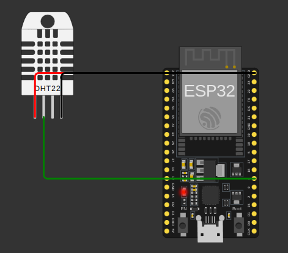

# Projet ESP32 avec Capteur DHT22

Ce projet utilise un ESP32 pour lire les données d'un capteur DHT22 et les envoyer à un serveur MQTT. Le montage est décrit dans `diagram.json`, et les configurations sont définies dans `config.h` et `config.js`.

## Matériel Requis

- ESP32
- Capteur DHT22
- Câbles de connexion

## Montage

Le montage du matériel est décrit dans le fichier [diagram.json](diagram.json). Assurez-vous de connecter le capteur DHT22 au pin GPIO 4 de l'ESP32.

## Configuration

### Fichier `config.h`

Le fichier [config.h](config.h) contient les configurations WiFi, MQTT et du capteur DHT :

```cpp
#ifndef SECRETS_H
#define SECRETS_H

// Configuration WiFi
const char* WIFI_SSID = "Wokwi-GUEST";
const char* WIFI_PASSWORD = "";

// Configuration MQTT
const char* MQTT_SERVER = "test.mosquitto.org";
const int MQTT_PORT = 1883;
const char* MQTT_CLIENT_ID = "ESP32_DHT_Sensor";

// Configuration du capteur DHT
#define DHTPIN 4  
#define DHTTYPE DHT22 

#endif 
```

### Fichier `config.js`

Le fichier [config.js](config.js) contient les configurations nécessaires pour la connexion MQTT côté client JavaScript.

```js
// Adresse du serveur API (ne pas inclure "http://")
const API_URL = "test.mosquitto.org:8080";

// Topics MQTT utilisés pour la communication
const MQTT_TOPIC_TEMPERATURE = "dht_data/temperature";
const MQTT_TOPIC_HUMIDITE = "dht_data/humidite";
```

### Explication des paramètres :
- **`API_URL`** : Définit l'URL du serveur MQTT WebSocket sans `"http://"`.  
- **`MQTT_TOPIC_TEMPERATURE`** : Le topic MQTT pour la température.  
- **`MQTT_TOPIC_HUMIDITE`** : Le topic MQTT pour l'humidité.  

Assurez-vous que `config.js` est bien inclus dans votre projet avant d'exécuter le script principal :

```html
<script src="config.js"></script>
<script src="app.js"></script>
```

---
## Montage

Le montage du matériel est décrit dans le fichier [diagram.json](diagram.json). 




## Directive de Montage

Pour un montage correct, suivez les instructions détaillées dans le fichier [diagram.json](diagram.json). Assurez-vous de vérifier les connexions suivantes :

- Connectez le capteur DHT22 au pin GPIO 4 de l'ESP32.
- Alimentez le capteur DHT22 avec une tension de 3.3V ou 5V.
- Connectez la broche de masse (GND) du capteur DHT22 à la broche GND de l'ESP32.

Ces connexions sont essentielles pour garantir le bon fonctionnement du capteur et la transmission correcte des données au serveur MQTT.

## Vidéo de démonstration

Voici une vidéo de démonstration du projet :


